<div align="center">

# 🏛️ TheHighestCommittee Homelab
### Advanced Multi-Host Docker Infrastructure

[](https://status.thehighestcommittee.com)
[](https://www.docker.com/)
[](LICENSE)
[](https://uptimerobot.com)

[Infrastructure](#-infrastructure-architecture) • [Network](#-network-topology) • [Services](#-service-directory) • [Hardware](#-hardware-specifications) • [Management](#-management--automation)

</div>

---

## 📖 Overview
This repository contains the Infrastructure-as-Code (IaC) configuration for **TheHighestCommittee**, a distributed homelab environment powering media streaming, AI inference, home automation, and data storage. The system is designed for high availability, automated synchronization, and centralized management.

### Key Features
- **Distributed Architecture**: Services are split across optimized logic/media/AI hosts.
- **Centralized Management**: Unified `orchestrate.sh` CLI for controlling all nodes.
- **GitOps Workflow**: Configuration managed via git, utilizing strict `.gitignore` for security.
- **Security First**: All secrets encrypted/managed via `.env` files, no hardcoded credentials.

---

## 🏗️ Infrastructure Architecture

```mermaid
graph TD
    subgraph "External Access"
        Internet((Internet))
        CF[Cloudflare DNS]
        Internet --> CF
    end

    subgraph "Edge Network"
        Router[Router / Gateway]
        CF --> Router
    end

    subgraph "Dell PowerEdge Server"
        direction TB
        iDRAC["🔧 iDRAC<br/>.50"]
        Proxmox["🏗️ Proxmox VE<br/>.40"]
        
        subgraph "Virtual Machines & LXCs"
            Traefik["Traefik (LXC)<br/>.2"]
            TrueNAS["💾 TrueNAS Scale (VM)<br/>.44"]
            Osiris["🖥️ Osiris (VM)<br/>.11"]
            b_Postgres["🐘 Postgres (VM)<br/>.12"]
        end
        
        iDRAC -.- Proxmox
        Proxmox --- Traefik
        Proxmox --- TrueNAS
        Proxmox --- Osiris
        Proxmox --- b_Postgres
        
        Router --> Traefik
    end

    subgraph "Physical Nodes"

        Thoth["🤖 Thoth AI<br/>.7<br/>i7-7700 / Tesla T4"]
        Tam["🎬 TamMediaBox<br/>.13<br/>Ryzen 5 / 62GB RAM"]
    end

    Traefik --> Osiris
    Traefik --> Thoth
    Traefik --> Tam
    Traefik --> TrueNAS
    
    Osiris -.-> TrueNAS
    Tam -.-> TrueNAS
    Thoth -.-> TrueNAS
    
    Osiris -.-> b_Postgres
    Thoth -.-> b_Postgres
```



---

## 💻 Hardware Specifications

| Hostname | Role | IP Address | CPU | RAM | Type |
| :--- | :--- | :--- | :--- | :--- | :--- |
| **UDM-SE** | **Gateway** | `192.168.0.1` | ARM Cortex-A57 | 4 GB | **Network Appliance** |
| **Dell Server** | **Physical Host** | `192.168.0.50` (iDRAC) | Intel Xeon E5-2640 v4 | 128 GB | **Bare Metal** |
| ↳ **Proxmox** | Hypervisor | `192.168.0.40` | - | 128 GB | **Debian 13** |
| ↳ **Traefik** | Edge Proxy | `192.168.0.2` | *Shared* | 2 GB | **LXC** |
| ↳ **TrueNAS** | Storage Server | `192.168.0.44` | *Passthrough* | 64 GB | **Debian 13** |
| ↳ **Osiris** | Docker Host | `192.168.0.11` | *Allocated* | 47 GB | **Ubuntu 24.04** |
| ↳ **Postgres** | Central DB | `192.168.0.12` | 2 vCPU | 8 GB | **Debian** |
| **Thoth** | AI Node | `192.168.0.7` | Intel Core i7-7700 | 64 GB | **Ubuntu 25.10** |
| **TamMediaBox** | Media Node | `192.168.0.13` | Ryzen 5 5650GE | 64 GB | **Ubuntu 25.10** |
| **UGREEN** | NAS | `192.168.0.8` | Pentium Gold 8505 | 64 GB | **Debian 12** |


---

## 🌐 Network Topology

Traffic is managed through a **Centralized Edge Proxy** architecture, ensuring secure and encrypted access to all services.

### 🔒 Traffic Flow

```mermaid
graph LR
    %% Styles
    classDef secure fill:#e1f5fe,stroke:#01579b,stroke-width:2px;
    classDef internal fill:#f3e5f5,stroke:#4a148c,stroke-width:2px;
    classDef router fill:#fff3e0,stroke:#e65100,stroke-width:2px;

    User((👤 User)) -->|HTTPS| CF[☁️ Cloudflare]
    CF -->|Encrypted| Router[Gateway]:::router
    Router -->|Port 443| Traefik[🚦 Traefik Proxy]:::secure
    
    subgraph "LAN (192.168.0.0/24)"
        Traefik -->|Routing| Osiris[🖥️ Osiris]:::internal
        Traefik -->|Routing| Thoth[🤖 Thoth]:::internal
        Traefik -->|Routing| Tam[🎬 TamMediaBox]:::internal
        Traefik -->|Routing| TrueNAS[💾 TrueNAS]:::internal
    end
```



- **Cloudflare**: Provides DDoS protection and DNS resolution.
- **Traefik**: Unique entry point handling **SSL Termination**, **Authentication**, and **Load Balancing**.
- **Internal**: Services communicate over the private `shared` Docker network or LAN.


---

## 📂 Repository Structure

```
/opt/stacks/
├── 📄 .env                         # Central configuration (Secrets excluded)
├── 🔧 scripts/                     # Automation & Orchestration CLI
├── 📚 docs/                        # Detailed guides & references
│
├── 📦 Stacks
│   ├── arrstack/
│   │   ├── compose.yaml
│   │   └── appdata/                # Local data (Sonarr, Radarr, etc.)
│   ├── books/
│   │   ├── compose.yaml
│   │   └── appdata/
│   ├── music/
│   │   ├── compose.yaml
│   │   └── appdata/
│   ├── gameservers/
│   │   ├── compose.yaml
│   │   └── appdata/
│   ├── utilities/
│   │   ├── compose.yaml
│   │   └── appdata/
│   ├── reporting/
│   │   ├── compose.yaml
│   │   └── appdata/
│   ├── arr_support/
│   │   ├── compose.yaml
│   │   └── appdata/
│   └── [others]                    # (comics, cooking, trackers, etc.)
```

---

## 🛠️ Management & Automation

The entire cluster is managed via the **`orchestrate.sh`** tool, located in `/opt/stacks/scripts/`.

### ⚡ Quick Commands

| Command | Alias | Description |
| :--- | :--- | :--- |
| `./orchestrate.sh status-all` | `stacks-status` | View container status across all hosts (ps) |
| `./orchestrate.sh check-all` | `stacks-health` | Run health checks & connectivity tests |
| `./orchestrate.sh sync-all` | `stacks-sync` | Sync configs & scripts to all nodes |
| `./orchestrate.sh pull-all` | `stacks-pull` | Update git repo & pull images everywhere |
| `./orchestrate.sh restart <stack>` | - | Restart a specific stack on its host |

### 🔄 Sync Workflow
We use `sync-env-to-hosts.sh` to ensure consistency:
1.  **Source**: `/opt/stacks/.env` and `/opt/stacks/scripts/` on **Osiris**.
2.  **Target**: Replicates to `Thoth` (.7) and `TamMediaBox` (.13) via `rsync`.
3.  **Trigger**: Runs automatically via `orchestrate.sh sync-all` or manually.

---

## 📦 Service Directory

### 🖥️ Host: Osiris (Primary)
The logic core of the homelab, running management, acquisition, and gaming workloads.

#### 🎬 Media Management (The Arrs)
| Service | Port | Info |
| :--- | :--- | :--- |
| **[Sonarr](https://sonarr.thehighestcommittee.com)** | `8989` | TV Shows (Anime/Standard) |
| **[Radarr](https://radarr.thehighestcommittee.com)** | `7878` | Movies |
| **[Lidarr](https://lidarr.thehighestcommittee.com)** | `8686` | Music |
| **[Prowlarr](https://prowlarr.thehighestcommittee.com)** | `9696` | Indexer Management |
| **[Bazarr](https://bazarr.thehighestcommittee.com)** | `6767` | Subtitles |
| **[Overseerr](https://overseerr.thehighestcommittee.com)** | `5055` | Request Management |
| **[Jellyseerr](https://jellyseerr.thehighestcommittee.com)** | `5056` | Alternative Request UI |
| **[Sportarr](https://sportarr.thehighestcommittee.com)** | `1867` | Live Sports |

#### 📚 Books & Comics
| Service | Port | Info |
| :--- | :--- | :--- |
| **[Audiobookshelf](https://audiobookshelf.thehighestcommittee.com)** | `13378` | Audiobook Streaming |
| **[Kavita](https://kavita.thehighestcommittee.com)** | `5002` | Manga/Comic Server |
| **[OpenBooks](https://openbooks.thehighestcommittee.com)** | `8084` | E-book Search |
| **[Shelfmark](https://shelfmark.thehighestcommittee.com)** | `6060` | Book Metadata |
| **[Booklore](https://booklore.thehighestcommittee.com)** | `8088` | Bookmark Manager |
| **[Kapowarr](https://kapowarr.thehighestcommittee.com)** | `5656` | Comic Downloading |
| **[Suwayomi](https://suwayomi.thehighestcommittee.com)** | `4567` | Manga Downloader |
| **[Mylar3](https://mylar3.thehighestcommittee.com)** | `8090` | Comic Management |

#### 🎮 Game Servers
| Server | Port | Info |
| :--- | :--- | :--- |
| **Enshrouded** | `15637` | Survival Action RPG |
| **Palworld** | `8211` | Monster Catcher Survival (UDP) |
| **Satisfactory** | `7777` | Factory Building Sim |
| **Ark: SA** | `7779` | Survival Ascended |
| **RomM** | `8082` | Retro Game Manager |

#### 🎵 Music & Audio
| Service | Port | Info |
| :--- | :--- | :--- |
| **Navidrome** | `4533` | Music Streamer |
| **Lidify** | `3030` | Spotify -> Lidarr |
| **Sonobarr** | `5003` | Music Integration |
| **Blissful** | `7373` | Music Tagging |
| **Slskd** | `5030` | Soulseek Client |
| **Soularr** | - | Slskd Integration |

#### 🛠️ Utilities & Support
| Service | Port | Info |
| :--- | :--- | :--- |
| **[Homepage](https://homepage.thehighestcommittee.com)** | `3333` | Main Dashboard |
| **[Homarr](https://start.thehighestcommittee.com)** | `7575` | Secondary Dashboard |
| **[Dozzle](https://dozzle.thehighestcommittee.com)** | `8880` | Log Viewer |
| **[Termix](https://termix.thehighestcommittee.com)** | `8081` | Web Terminal |
| **[Flaresolverr](https://flaresolverr.thehighestcommittee.com)** | `8191` | Cloudflare Solver |
| **[Tautulli](https://tautulli.thehighestcommittee.com)** | `8181` | Plex Monitoring |
| **Notifiarr** | - | Discord Notifications |
| **Discodrome** | - | Discord Music Bot |

---

### 🎬 Host: TamMediaBox (Media)
Dedicated hardware for transcoding and playback.

| Service | Port | Hardware Accel | Purpose |
| :--- | :--- | :--- | :--- |
| **Plex** | `32400` | ✅ iGPU (Radeon) | Primary Media Player |
| **Jellyfin** | `8096` | ✅ iGPU (Radeon) | Secondary Media Player |
| **mstream** | `3000` | - | FLAC/Music Streaming |

---

### 🤖 Host: Thoth (AI)
Specialized node for LLM inference and AI processing.

| Service | Port | Hardware Accel | Purpose |
| :--- | :--- | :--- | :--- |
| **[Ollama](https://ollama.thehighestcommittee.com)** | `11434` | ✅ Tesla T4 | LLM Inference Backend |
| **[Open WebUI](https://chat.thehighestcommittee.com)** | `8080` | - | Chat Interface (ChatGPT-like) |
| **[Whisper](https://whisper.thehighestcommittee.com)** | `9000` | ✅ Tesla T4 | Speech-to-Text Transcriber |
| **Paperless-AI** | `3001` | - | AI Document Tagging |
| **[Paperless-NGX](https://paperless.thehighestcommittee.com)** | `8000` | - | Document Archival System |
| **[Dockge](https://dockge.thehighestcommittee.com)** | `5001` | - | Stack Manager |

---

### 💾 Host: TrueNAS (Storage)
ZFS Storage Array and heavy download client.

| Service | Type | Purpose |
| :--- | :--- | :--- |
| **TrueNAS Scale** | OS | ZFS Pool Management |
| **qBittorrent** | WebUI | Torrent Downloader |
| **SABnzbd** | WebUI | Usenet Downloader |


---

## 📊 Dashboard
All services are aggregated in a central **Homepage** dashboard.
- **URL**: `https://homepage.thehighestcommittee.com` (Internal)
- **Features**: Live resource usage, service health status, calendar integration, and quick access links.

---

## 🔄 Service Workflows

### 🎬 Media Acquisition & Streaming
How content moves from request to playback across hosts.


### 🤖 AI Inference Pipeline
How the AI stack processes requests on **Thoth**.


---

<div align="center">
<sub>Powered by TheHighestCommittee Infrastructure</sub>
</div>
